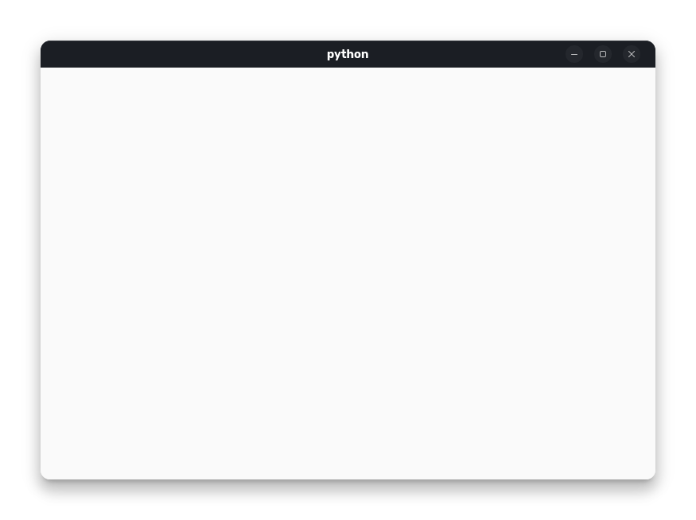

# how to learn Gtk4 with python ? 
hi 👋 To my programmer friends! today let's learn Gtk4 with python for create any application📱 
I'm just learning GTK myself, so I'm trying to share anything new I learn about it here.

If you liked it and I was able to help you on your way to learning GTK, I would be happy if you would star the project ⭐

## install Gtk4 for python 

you can install Gtk4 for python with pip

first install pycairo with this command :

~~~shell
pip install pycairo
~~~

and next install gtk for python with this command : 

~~~shell
pip install PyGObject
~~~
Congratulations, you have successfully installed GTK on your Python. 😍

## use Gtk4 in python 
for use gtk version 4 in python and create your helpful application import gtk from gi and utilize this mudle in your apps
### 1. import Gtk
for import gtk you can type this code's 
~~~python
import gi
#setup to version 4.0
gi.require_version('Gtk','4.0')
#import Gtk 
from gi.repository import Gtk
~~~

### 2. create your first gui app with gtk
create your window with Gtk.ApplicationWindow() object

~~~python
def on_open_application(app):
    window = Gtk.ApplicationWindow(application = app) # create window
    window.present() # show window
~~~

### 3. create your application and connect to your window and in last step run it !
~~~python
app = Gtk.Application() # create application
app.connect("activate",on_open_application) # connect your application to window

app.run(None) #start your application
~~~
### 4. run your program with python
you succsessful develop your first application 
compileted code : 
~~~python
import gi
#setup to version 4.0
gi.require_version('Gtk','4.0')
#import Gtk 
from gi.repository import Gtk

def on_open_application(app):
    window = Gtk.ApplicationWindow(application = app) # create window
    window.present() # show window

app = Gtk.Application() # create application
app.connect("activate",on_open_application) # connect your application to window

app.run(None) #start your application
~~~
i write it code on first_app.py in this repository

~~~shell
python your_app.py 
~~~

